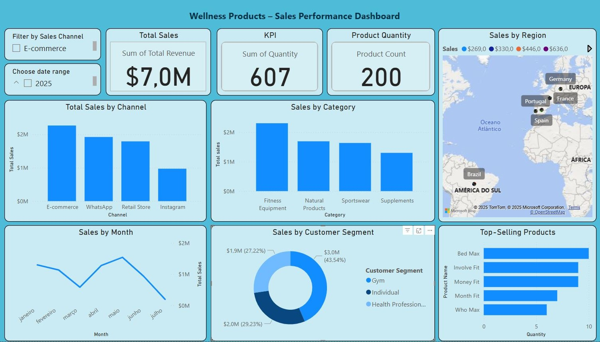

# Wellness Sales Analysis – Power BI Project 🚀

I’m excited to share my latest Power BI dashboard built as part of a hands-on business analytics project:

🔍 **Wellness Sales Performance Dashboard**  
📦 **Project Focus**: Analyzing wellness product sales to identify trends across channels, regions, and customer segments, enabling better strategic decisions.

This interactive dashboard explores key performance indicators such as:

📈 **Total Sales Analysis**  
📦 **Top-Selling Products by Quantity**  
👥 **Customer Segment Insights**  
🗺️ **Sales by Region (Map Visualization)**  
📊 **Sales Channel Analysis**  
📅 **Monthly Sales Trends**

---

## Tools & Techniques Used
- Power BI  
- Data Modeling  
- DAX Measures  
- Data Cleaning  
- Data Visualization & Storytelling

---

## What I Learned
This project helped strengthen my skills in:
- Interactive dashboards  
- Designing user-friendly visuals and layouts  
- Creating calculated columns and measures  
- Communicating data-driven insights effectively

---

## 📁 Project Files
- `wellness_sales.pbix` – Power BI dashboard file  
- `wellness_sales_dataset.csv` – Simulated sales data  
- `dashboard_screenshot.png` – Visual preview of the dashboard

---

## 📸 Dashboard Preview

---

👉 **Explore the full project here:**  
🔗 [https://github.com/natalia-hg/wellness-powerbi-dashboard](#)

I'm always open to feedback and collaboration!

---

#hashtags  
#PowerBI #DataAnalytics #DashboardDesign #WellnessIndustry #DataVisualization #GitHub #DataStorytelling #SalesAnalysis #PortfolioProject #BusinessIntelligence #LearningByDoing
